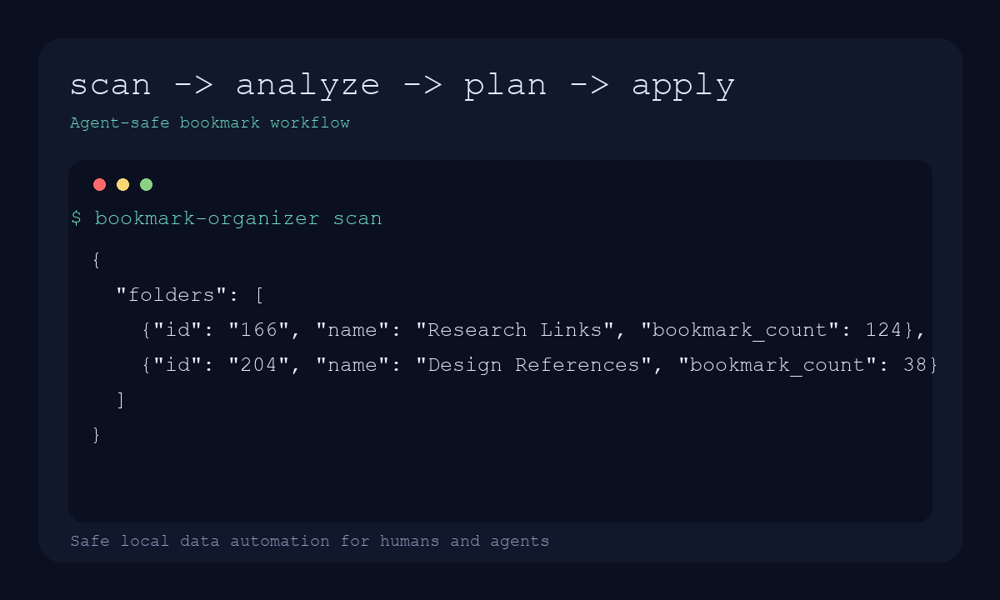

# bookmark-organizer

[English](README.md) | [简体中文](README.zh-CN.md)

`bookmark-organizer` 是一个 Python CLI，用来扫描、分析、规划并安全地重组浏览器书签。

它不是“直接帮你乱改书签”的黑盒，而是一个面向人和 Agent 的安全流程：

- 所有输出都可机器读取
- 先生成确定性的 `plan.json`
- 真正写回前先备份
- 默认先 dry run，再 apply

## 这个项目解决什么问题

大多数书签工具要么只是“粗暴归类”，要么依赖手动拖拽。这个项目把书签整理抽象成一个可审计的流程：

1. 先发现候选文件夹
2. 再把目标子树展平
3. 按 taxonomy 生成分类计划
4. 先 review `plan.json`
5. 最后才真正写回

核心目标不是“更聪明地自动分类”，而是把高风险的本地数据修改变成可检查、可复核、可回滚的协议。



## 当前能力

- 支持 Chrome 书签文件
- 支持 macOS、Windows、Linux 的 Chrome profile 路径发现
- 支持基于 taxonomy JSON 的文件夹重组
- 写回前自动备份
- 生成可复用、可审查的计划文件

## 安装

```bash
python3 -m venv .venv
source .venv/bin/activate
pip install .
```

如果你只想直接从源码运行：

```bash
PYTHONPATH=src python3 -m bookmark_organizer.cli scan
```

## 快速开始

先运行 `bookmark-organizer scan`，再把下面命令里的 `<folder-name>` 或 `<folder-id>` 替换成你自己的目标文件夹，不要直接照抄占位符。

查看顶层文件夹：

```bash
bookmark-organizer scan
bookmark-organizer scan --profile Default
```

展平目标文件夹：

```bash
bookmark-organizer analyze --root-name "<folder-name>"
bookmark-organizer analyze --root-id <folder-id> --output /tmp/bookmarks.json
```

生成可审查的计划文件：

```bash
bookmark-organizer plan --root-name "<folder-name>" --output /tmp/plan.json
bookmark-organizer plan --root-name "<folder-name>" --taxonomy examples/default-taxonomy.json --include-debug
```

写回前先校验计划：

```bash
bookmark-organizer validate --plan-file /tmp/plan.json
```

查看这份计划会带来哪些移动：

```bash
bookmark-organizer diff --plan-file /tmp/plan.json
```

确认计划无误后，关闭 Chrome 再执行：

```bash
bookmark-organizer apply --plan-file /tmp/plan.json
```

## 四步工作流

### `scan`

列出可整理的书签文件夹，以及每个文件夹里的书签数和子文件夹数。

### `analyze`

把目标文件夹下的所有书签展平成一份列表，避免旧的嵌套结构干扰后续分类。

### `plan`

生成确定性的 `plan.json`。这是默认 dry run 步骤，不会修改你的书签。

### `apply`

写回前先备份，再校验计划是否仍然覆盖当前书签 id，最后重建目标文件夹结构。

### `validate`

在真正写回前，检查这份 `plan.json` 是否已经过期、是否有重复分配、是否缺失书签 id，或者是否还有未覆盖的书签。

### `diff`

对比“当前顶层结构”和“计划中的目标结构”，快速看到哪些书签会被移动到哪里。

## `plan.json` 长什么样

```json
{
  "target": { "id": "166", "name": "Research Links" },
  "folder_specs": [
    { "id": "cat-01", "name": "01 SEO & Marketing" }
  ],
  "plan": {
    "cat-01": ["49", "196"]
  }
}
```

## 安全模型

- `scan` 和 `analyze` 只读
- `plan` 只读
- `apply` 写回前一定先备份
- `apply` 默认要求 Chrome 已关闭
- `apply` 会校验计划里的书签 id 是否仍匹配当前数据

## 面向 Agent 的用法

任何 Agent 都可以把它当成一个固定协议：

1. `scan` 发现候选目标
2. `analyze` 展平目标数据
3. `plan` 生成 `plan.json`
4. `apply` 在确认后写回

这样自动化流程不需要自己发明一套临时协议，也更容易做人工 review 或二次校验。

## 项目结构

```text
src/bookmark_organizer/   CLI 与核心书签处理逻辑
examples/                 taxonomy 和示例 fixture
tests/                    回归测试
marketing/                发布文案草稿
media/                    README 资源文件
.github/                  issue 模板、PR 模板、CI
```

## 本地开发

运行测试：

```bash
python3 -m unittest discover -s tests -v
```

查看 CLI 帮助：

```bash
PYTHONPATH=src python3 -m bookmark_organizer.cli --help
```

## 路线图

- Edge / Brave 适配器
- 浏览器运行时 API fallback
- 重复书签检测
- 死链检测
- 交互式 TUI 选择

## 贡献

开发约定和提 issue 方式见 [CONTRIBUTING.md](CONTRIBUTING.md)。

## 安全

如果你发现的是数据丢失、错误写回、路径越界之类的问题，请先看 [SECURITY.md](SECURITY.md)。
